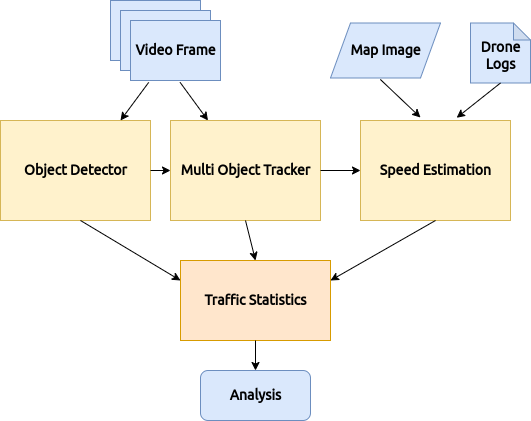
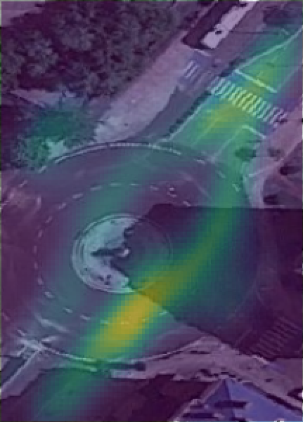

## Traffic Analysis from UAV data

This framework aims to analyze car traffic from data collected using a drone.
For the complete functioning of the framework, three inputs are necessary:
- A video captured by the drone with the pitch at -90º.
- A georeferenced image of the location where the drone flew over (geotiff).
- The drone logs from the video.

The proposed method consists of three main modules:



- Object Detector - This framework offers 3 different models to detect vehicles: YOLOv5, Faster-RCNN and TPH-YOLOv5.
- Multi Object Tracker- This module is responsible for tracking vehicles along the video frames. For this we use DeepSort.
- Speed Estimation - This module is dependent on the previous modules and is responsible for estimating the speed of vehicles (even in videos with the drone in motion).

To learn more about this framework, we advise you to read the respective [report](assets/report.pdf).

## Demo

Speed Estimation with drone in motion.


Vehicle counting.


Traffic density heatmap.



## Run

To run you must have a folder with three subfolders (logs, map, video). Inside logs it must contain a .csv file with drone logs, inside map it must contain a .tiff (geotiff) with the georreferenced map and inside video it must contain the drone captured video.

To run you can simply execute:
```
python3 main.py --path examples/roundabout --model yolov5l-xs.pt --img-size 1920 
```